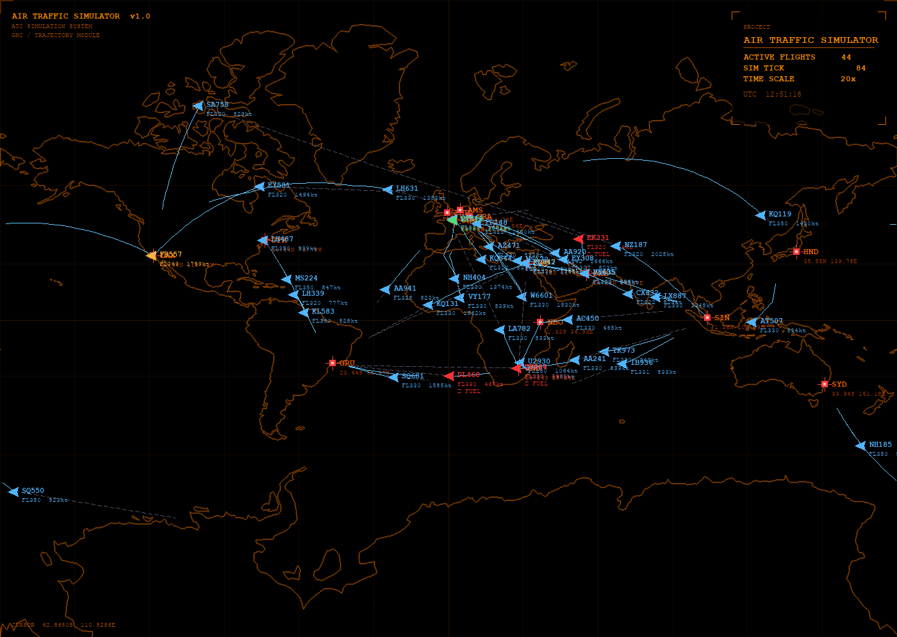

# Air Traffic Simulator — Documentation Technique

> Simulateur de trafic aérien temps-réel orienté physique de vol, GNC et cartographie.  
> Architecture hexagonale Python · pygame · 15 aéroports · 300 corridors · modèles ISA/Breguet/Haversine


---

## Table des matières

1. [Architecture générale](#1-architecture-générale)
2. [Boucle de simulation](#2-boucle-de-simulation)
3. [Modèle atmosphérique ISA](#3-modèle-atmosphérique-isa)
4. [Aérodynamique — vitesse de décrochage](#4-aérodynamique--vitesse-de-décrochage)
5. [Contrôle de vitesse et marge de sécurité](#5-contrôle-de-vitesse-et-marge-de-sécurité)
6. [Modèle de carburant — équation de Breguet](#6-modèle-de-carburant--équation-de-breguet)
7. [Consommation par phase de vol](#7-consommation-par-phase-de-vol)
8. [Navigation sphérique — formule de Haversine](#8-navigation-sphérique--formule-de-haversine)
9. [Propagation de position — interpolation géodésique](#9-propagation-de-position--interpolation-géodésique)
10. [Cap (heading)](#10-cap-heading)
11. [Modèle de montée/descente](#11-modèle-de-montéedescente)
12. [ETA complète du vol](#12-eta-complète-du-vol)
13. [Cartographie — projection de Mercator](#13-cartographie--projection-de-mercator)
14. [Zoom & pan — transformation écran](#14-zoom--pan--transformation-écran)
15. [Pathfinding taxiway — algorithme A*](#15-pathfinding-taxiway--algorithme-a)
16. [Gestion des corridors aériens](#16-gestion-des-corridors-aériens)
17. [Constantes et paramètres de référence](#17-constantes-et-paramètres-de-référence)
18. [Démarrage rapide](#18-démarrage-rapide)

---

## 1. Architecture générale

```
main/
├── aircraft/          — Domaine appareil (masse, vitesse, ailes, carburant)
├── airport/           — Aéroports, pistes, terminaux, gates, taxiways
├── air_corridor/      — Corridors aériens ICAO avec waypoints
├── flight/            — Domaine vol + services physique/timing/fuel
└── shared/
    ├── simulator/
    │   ├── departure_simulator/   — Embarquement → décollage
    │   ├── flight_simulator/      — Croisière, montée, descente
    │   └── landing_simulator/     — Descente finale
    └── adapter/visualizer/        — Rendu pygame (carte, vols, HUD)
```

**Paramètres de la boucle :**

| Paramètre | Valeur | Unité |
|---|---|---|
| `TICK_INTERVAL` | 1.0 | s (temps réel par tick) |
| `TIME_SCALE` | 20 | × (accélération simulation) |
| `SIM_TICK` | 20.0 | s simulés par tick |
| `FPS_TARGET` | 60 | frames/s |

---

## 2. Boucle de simulation

À chaque tick de durée $\Delta t_{\text{réel}} = 1\,\text{s}$, le temps simulé avance de :

$$\Delta t_{\text{sim}} = \Delta t_{\text{réel}} \times \tau_{\text{scale}} = 1 \times 20 = 20\,\text{s}$$

La séquence d'exécution est :

1. `_tick_runway()` — progression des vols au sol (PLANNED → BOARDING → LINEUP → TAKEOFF)
2. `_tick_flight()` — mise à jour physique de chaque vol en l'air (CLIMBING → CRUISE → DESCENDING)
3. `visualizer.update()` + `visualizer.draw()` — rendu à 60 fps

---

## 3. Modèle atmosphérique ISA

La densité de l'air est calculée par le modèle d'atmosphère standard internationale (ISA) via la loi polytropique :

$$\rho(h) = \rho_0 \left(1 - \frac{\Lambda \cdot h}{T_0}\right)^{\frac{g}{\Lambda R} - 1}$$

Implémentée sous forme compacte (troposphère, $h < 11\,000\,\text{m}$) :

$$\boxed{\rho(h) = 1.225 \times \max\!\left(0,\; 1 - 2.2558 \times 10^{-5}\, h\right)^{4.2561} \quad [\text{kg/m}^3]}$$

avec $h$ en mètres, $\rho_0 = 1.225\,\text{kg/m}^3$ (densité au niveau de la mer, 15 °C, 101 325 Pa).

Les exposants proviennent de :
- $2.2558 \times 10^{-5} = \Lambda / T_0 = 0.0065 / 288.15$
- $4.2561 = g / (\Lambda R) = 9.80665 / (0.0065 \times 287.058)$

**Fichier :** `shared/simulator/flight_simulator/flight.py` — `_compute_rho()`

---

## 4. Aérodynamique — vitesse de décrochage

La vitesse de décrochage $V_s$ est la vitesse minimale à laquelle la portance $L$ équilibre le poids $W$ :

$$L = W \implies \frac{1}{2} \rho V_s^2 S \, C_{L_{\max}} = m g$$

D'où :

$$\boxed{V_s = \sqrt{\frac{2\, m g}{\rho\, S\, C_{L_{\max}}}} \quad [\text{m/s}]}$$

| Symbole | Définition | Unité |
|---|---|---|
| $m$ | Masse totale en opération (`fuel_kg` inclus) | kg |
| $g$ | Accélération gravitationnelle = 9.81 | m/s² |
| $\rho$ | Densité de l'air à l'altitude courante | kg/m³ |
| $S$ | Surface alaire (`wing_area_m2`) | m² |
| $C_{L_{\max}}$ | Coefficient de portance max (`CL_max`) | — |

**Valeurs $C_{L_{\max}}$ selon configuration :**

| Configuration | $C_{L_{\max}}$ |
|---|---|
| Croisière (ailes propres) | 1.4 |
| Décollage (flaps partiels) | 2.0 |
| Atterrissage (flaps + slats) | 2.7 |

**Fichier :** `flight/application/flight_physics_service.py` — `compute_v_stall()`

---

## 5. Contrôle de vitesse et marge de sécurité

La réglementation impose une marge de sécurité de 30 % au-dessus de $V_s$ :

$$V_{\text{cruise,min}} = 1.3 \times V_s$$

La vitesse assignée au vol est :

$$V_{\text{flight}} = \max\!\left(V_{\text{cruise,aircraft}},\; 1.3 \times V_s\right) \times 3.6 \quad [\text{km/h}]$$

Ce calcul est répété à chaque tick en CRUISE pour tenir compte de la consommation de carburant (réduction de masse → réduction de $V_s$).

**Fichier :** `shared/simulator/flight_simulator/flight.py` — `_update_v_stall()`

---

## 6. Modèle de carburant — équation de Breguet

La quantité de carburant de croisière est calculée par l'équation de Breguet pour avion à réaction :

$$\boxed{m_{\text{fuel,trip}} = W_0 \left(1 - e^{-\dfrac{R \cdot \text{TSFC}}{(L/D)\, V}}\right)}$$

| Symbole | Définition | Valeur/Unité |
|---|---|---|
| $W_0 = m_0 g$ | Poids initial (OEW + payload + phases + carburant estimé) | N |
| $R$ | Distance du corridor | m |
| $\text{TSFC}$ | Thrust Specific Fuel Consumption | $1.8 \times 10^{-5}$ kg/(N·s) |
| $L/D$ | Finesse aérodynamique (`ld_ratio`) | — |
| $V$ | Vitesse croisière | m/s |

**Convergence itérative (4 itérations) :**

Comme $W_0$ dépend du carburant lui-même, on résout par point fixe :

$$m_{\text{fuel}}^{(k+1)} = \left(m_{\text{OEW}} + m_{\text{payload}} + m_{\text{phases}} + m_{\text{fuel}}^{(k)}\right) \cdot g \cdot \left(1 - e^{-\frac{R \cdot \text{TSFC}}{(L/D)\,V}}\right) / g$$

Initialisation : $m_{\text{fuel}}^{(0)} = 5\,000\,\text{kg}$.

**Carburant total avec réserve réglementaire ICAO :**

$$m_{\text{total}} = \min\!\left(\left(m_{\text{trip}} + m_{\text{phases}}\right) \times 1.15,\; m_{\text{fuel,max}}\right)$$

**Fichier :** `shared/simulator/departure_simulator/compute_fuel.py` — `compute_flight_fuel()`

---

## 7. Consommation par phase de vol

Le taux de consommation instantané est modulé par un facteur de phase $k_\phi$ relatif au régime croisière :

$$\dot{m}_{\text{fuel}}(\phi) = \dot{m}_{\text{cruise}} \times k_\phi$$

$$\Delta m_{\text{fuel}} = \dot{m}_{\text{cruise}} \times k_\phi \times \Delta t_{\text{réel}}$$

| Phase $\phi$ | Facteur $k_\phi$ | Justification physique |
|---|---|---|
| `LINEUP` | 0.24 | Ralenti sol, APU |
| `TAKEOFF` | 3.30 | Poussée maximale, post-combustion partielle |
| `CLIMBING` | 2.47 | ≈ $\dot{m}_{\text{climb}} / \dot{m}_{\text{cruise}}$ |
| `CRUISE` | 1.00 | Référence |
| `DESCENDING` | 0.29 | Moteurs réduits (idle descent) |
| `LANDING` | 0.35 | Inverseurs de poussée + approche |
| `TAXI` | 0.24 | Roulage arrivée |

**Alerte carburant critique :** si le carburant restant représente moins de 30 minutes d'autonomie croisière :

$$\frac{m_{\text{fuel}}}{\dot{m}_{\text{cruise}}} < 1800\,\text{s} \implies \texttt{FUEL\_CRITICAL}$$

**Fichier :** `flight/application/flight_physics_service.py` — `update_flight_fuel()`

---

## 8. Navigation sphérique — formule de Haversine

La distance orthodromique (grand cercle) entre deux points géographiques est calculée par la formule de Haversine, numériquement stable pour les courtes et longues distances :

$$a = \sin^2\!\frac{\Delta\varphi}{2} + \cos\varphi_1 \cos\varphi_2 \sin^2\!\frac{\Delta\lambda}{2}$$

$$\boxed{d = 2 R_\oplus \arcsin\!\sqrt{a}}$$

avec $R_\oplus = 6\,371\,\text{km}$, $\varphi$ = latitude en radians, $\lambda$ = longitude en radians.

**Précision numérique :** $a$ est clampé dans $[0, 1]$ pour éviter les domaines invalides de $\arcsin$ dus aux erreurs d'arrondi flottant.

**Utilisations dans le projet :**
- Distance entre aéroports pour le calcul de carburant
- Distance résiduelle pour l'ETA en croisière
- Heuristique $h(n)$ dans l'A* taxiway (voir §15)

**Fichiers :** `flight/application/flight_physics_service.py`, `airport/application/taxiway_pathfinding_service.py`

---

## 9. Propagation de position — interpolation géodésique

À chaque tick de simulation, la position est propagée le long du grand cercle entre la position courante $P_1(\varphi_1, \lambda_1)$ et la destination $P_2(\varphi_2, \lambda_2)$.

**Fraction de chemin parcouru par tick :**

$$f = \frac{v_{\text{km/s}} \times \Delta t_{\text{sim}}}{d}$$

où $v_{\text{km/s}} = V_{\text{flight}} / 3600$ et $d$ est la distance orthodromique courante.

**Interpolation sphérique (Slerp géodésique) :**

Soit $\delta = 2\arcsin\sqrt{a}$ l'angle central entre les deux points. Les coefficients d'interpolation sont :

$$A = \frac{\sin((1-f)\,\delta)}{\sin\delta}, \qquad B = \frac{\sin(f\,\delta)}{\sin\delta}$$

Les coordonnées cartésiennes interpolées en ECEF :

$$\begin{pmatrix} x \\ y \\ z \end{pmatrix} = A \begin{pmatrix} \cos\varphi_1\cos\lambda_1 \\ \cos\varphi_1\sin\lambda_1 \\ \sin\varphi_1 \end{pmatrix} + B \begin{pmatrix} \cos\varphi_2\cos\lambda_2 \\ \cos\varphi_2\sin\lambda_2 \\ \sin\varphi_2 \end{pmatrix}$$

Retour en coordonnées géographiques :

$$\boxed{\varphi = \arctan2\!\left(z,\, \sqrt{x^2+y^2}\right), \qquad \lambda = \arctan2(y,\, x)}$$

Cette méthode garantit que l'avion suit exactement le grand cercle, sans dérive due aux intégrations successives en coordonnées sphériques.

**Vitesse adaptative :** si `estimated_arrival_time` est dans le futur, la vitesse est recalculée dynamiquement :

$$v_{\text{km/s}} = \frac{d}{t_{\text{restant}}}$$

**Fichier :** `flight/application/flight_physics_service.py` — `update_position()`

---

## 10. Cap (heading)

Le cap magnétique (azimut initial du grand cercle) est calculé par la formule des caps orthodromiques :

$$\theta = \arctan2\!\left(\sin\Delta\lambda \cos\varphi_2,\; \cos\varphi_1\sin\varphi_2 - \sin\varphi_1\cos\varphi_2\cos\Delta\lambda\right)$$

converti en degrés $[0°, 360°)$ pour l'affichage du triangle avion dans le visualizer.

---

## 11. Modèle de montée/descente

L'altitude est ajustée progressivement vers l'altitude cible du waypoint courant, limitée par le taux de montée de l'appareil :

**Altitude cible d'un waypoint :**

$$h_{\text{target}} = \frac{h_{\min} + h_{\max}}{2} \times 0.3048 \quad [\text{m}]$$

(milieu de la plage FL en pieds, converti en mètres : $1\,\text{ft} = 0.3048\,\text{m}$)

**Taux de montée converti :**

$$\dot{h} = R_c \times 0.00508 \quad [\text{m/s}]$$

avec $R_c$ en ft/min ($1\,\text{ft/min} = 0.00508\,\text{m/s}$).

**Mise à jour altitude par tick :**

$$\Delta h_{\max} = \dot{h} \times \Delta t_{\text{réel}}$$

$$h^{(k+1)} = \begin{cases} h_{\text{target}} & \text{si } |h_{\text{target}} - h^{(k)}| \leq \Delta h_{\max} \\ h^{(k)} + \text{sign}(h_{\text{target}} - h^{(k)}) \times \Delta h_{\max} & \text{sinon} \end{cases}$$

**Fichier :** `shared/simulator/flight_simulator/flight.py` — `_update_altitude_toward()`

---

## 12. ETA complète du vol

L'heure d'arrivée estimée est calculée en sommant les distances restantes de tous les segments (waypoints + aéroport d'arrivée) :

$$d_{\text{total}} = \sum_{i=i_{\text{courant}}}^{N-1} \text{Haversine}(P_i, P_{i+1}) + \text{Haversine}(P_{N-1}, A_{\text{arr}})$$

$$t_{\text{restant}} = \frac{d_{\text{total}} / V_{\text{km/s}}}{\tau_{\text{scale}}} + t_{\text{descent}} + t_{\text{landing}} + t_{\text{taxi}}$$

$$\text{ETA} = t_{\text{now}} + t_{\text{restant}}$$

Cette ETA est recalculée à chaque tick CRUISE pour tenir compte des variations de vitesse et de la progression réelle.

**Fichier :** `flight/application/flight_timing_service.py` — `compute_full_eta()`

---

## 13. Cartographie — projection de Mercator

La projection de Mercator Web (EPSG:3857) est utilisée pour l'affichage. La latitude $\varphi$ est transformée en ordonnée normalisée $n_y \in [0, 1]$ :

$$\psi(\varphi) = \ln\!\left(\tan\!\frac{\pi}{4} + \frac{\varphi}{2}\right) \quad \text{(ordonnée de Mercator)}$$

$$\psi_{\max} = \ln\!\left(\tan\!\frac{\pi}{4} + \frac{85°}{2}\right)$$

$$\boxed{n_y = \frac{1}{2} - \frac{\psi(\varphi)}{2\,\psi_{\max}}}$$

La longitude est projetée linéairement :

$$n_x = \frac{\lambda + 180°}{360°}$$

**Projection inverse** (pixel → géographie, utilisée pour l'affichage des coordonnées sous le curseur) :

$$\varphi = 2\arctan\!\left(e^{\psi}\right) - \frac{\pi}{2}, \qquad \psi = (1 - n_y) \times 2\psi_{\max} - \psi_{\max}$$

La projection est clampée à $\pm 85°$ de latitude pour éviter la singularité aux pôles ($\psi \to \pm\infty$).

**Fichier :** `shared/adapter/visualizer/renderer/world_map.py`

---

## 14. Zoom & pan — transformation écran

La transformation écran applique un zoom centré et un décalage de caméra :

**Normalisation → pixel avec zoom/pan :**

$$\begin{pmatrix} p_x \\ p_y \end{pmatrix} = \begin{pmatrix} (n_x \cdot W - c_x) \cdot z + c_x - \delta_x \\ (n_y \cdot H - c_y) \cdot z + c_y - \delta_y \end{pmatrix}$$

avec $(c_x, c_y) = (W/2, H/2)$ le centre de la fenêtre, $z$ le facteur de zoom, $(\delta_x, \delta_y)$ le décalage de pan.

**Zoom centré sur le curseur** (zoom-to-pointer) — mise à jour du pan pour maintenir le point sous le curseur $(m_x, m_y)$ fixe après un changement de zoom $z \to z'$ :

$$\delta_x' = \frac{z'}{z}\,(\delta_x + m_x - c_x) - (m_x - c_x)$$
$$\delta_y' = \frac{z'}{z}\,(\delta_y + m_y - c_y) - (m_y - c_y)$$

**Contrainte de pan** (empêcher de sortir de la carte) :

$$|\delta_x| \leq \frac{(z-1) \cdot W}{2}, \qquad |\delta_y| \leq \frac{(z-1) \cdot H}{2}$$

**Projection inverse avec zoom/pan** (pixel → géographie) :

$$n_x = \frac{(p_x + \delta_x - c_x) / z + c_x}{W}, \qquad n_y = \frac{(p_y + \delta_y - c_y) / z + c_y}{H}$$

**Fichier :** `shared/adapter/visualizer/visualizer.py`

---

## 15. Pathfinding taxiway — algorithme A*

La recherche du chemin optimal sur le graphe de taxiway (gate → seuil de piste) utilise l'algorithme A* avec heuristique admissible haversine.

**Fonction de coût total :**

$$f(n) = g(n) + h(n)$$

- $g(n)$ : coût cumulé depuis la source (somme des distances en mètres des arêtes parcourues)
- $h(n)$ : heuristique admissible = distance haversine en mètres jusqu'au goal

$$h(n) = 2 R_\oplus \arcsin\!\sqrt{\sin^2\!\frac{\Delta\varphi}{2} + \cos\varphi_n\cos\varphi_{\text{goal}}\sin^2\!\frac{\Delta\lambda}{2}}$$

L'heuristique est admissible car la distance haversine est la distance minimale sur la sphère, inférieure ou égale à toute distance réelle sur le graphe de taxiway.

**Structure du graphe :**
- Nœuds : gates, intersections, seuils de piste
- Arêtes : segments de taxiway avec distance en mètres
- Graphe non-orienté (bidirectionnel)

**Complexité :** $O((V + E) \log V)$ avec tas binaire.

**Fichier :** `airport/application/taxiway_pathfinding_service.py` — `find_path_graph()`

---

## 16. Gestion des corridors aériens

**Sélection aléatoire de destination :** pour éviter que tous les vols convergent vers la même destination, la sélection se fait en deux étapes :

1. Construire l'ensemble des destinations atteignables depuis l'aéroport de départ $A$ :

$$\mathcal{D}(A) = \left\{ \text{dest}(c) \mid c \in \mathcal{C},\; c.\text{has\_capacity}() \wedge c.\text{is\_open}() \wedge (c.from = A \vee (c.dir = \text{BIDI} \wedge c.to = A)) \right\}$$

2. Tirer uniformément une destination $d \sim \mathcal{U}(\mathcal{D}(A))$, puis tirer uniformément un corridor $c \sim \mathcal{U}(\{c \mid \text{dest}(c) = d\})$.

**Support bidirectionnel :** un corridor $A \to B$ avec `direction = BIDIRECTIONAL` peut être utilisé dans les deux sens. Lorsqu'on part depuis $B$, l'aéroport d'arrivée assigné est $A$ :

$$\text{arrival\_airport} = \begin{cases} c.to & \text{si } c.from = \text{depart} \\ c.from & \text{si } c.to = \text{depart} \land c.dir = \text{BIDI} \end{cases}$$

**Fichier :** `air_corridor/application/corridor_service.py`

---

## 17. Constantes et paramètres de référence

| Constante | Valeur | Source |
|---|---|---|
| $R_\oplus$ | 6 371 km | Rayon moyen terrestre (IUGG) |
| $\rho_0$ | 1.225 kg/m³ | ISA MSL |
| $T_0$ | 288.15 K | ISA MSL |
| $\Lambda$ | 0.0065 K/m | Gradient thermique ISA |
| $g$ | 9.80665 m/s² | Standard gravity |
| $R$ | 287.058 J/(kg·K) | Constante des gaz parfaits, air sec |
| TSFC | $1.8 \times 10^{-5}$ kg/(N·s) | Turbofan haute dilution typique |
| Réserve ICAO | 15 % | Annexe 6 ICAO |
| Masse pax + bagage | 95 kg | EASA CS-25 standard |
| $C_{L_{\max}}$ croisière | 1.4 | Profil typique turbofan |
| 1 ft | 0.3048 m | — |
| 1 ft/min | 0.00508 m/s | — |

---

## 18. Démarrage rapide

```bash
# Dépendances
pip install pygame geodatasets geopandas shapely

# Lancer le simulateur
cd main
python main.py

# Visualizer seul (sans simulation)
python shared/adapter/visualizer/visualizer.py
```

**Contrôles visualizer :**

| Entrée | Action |
|---|---|
| Molette souris | Zoom centré sur curseur |
| Clic droit + drag | Pan |
| `+` / `-` | Zoom clavier |
| `R` | Reset vue monde |
| Clic gauche sur avion | Sélectionner vol |
| `ESC` | Désélectionner |
| `Q` | Quitter |

---

*Document généré depuis le code source — toutes les formules reflètent l'implémentation effective.*